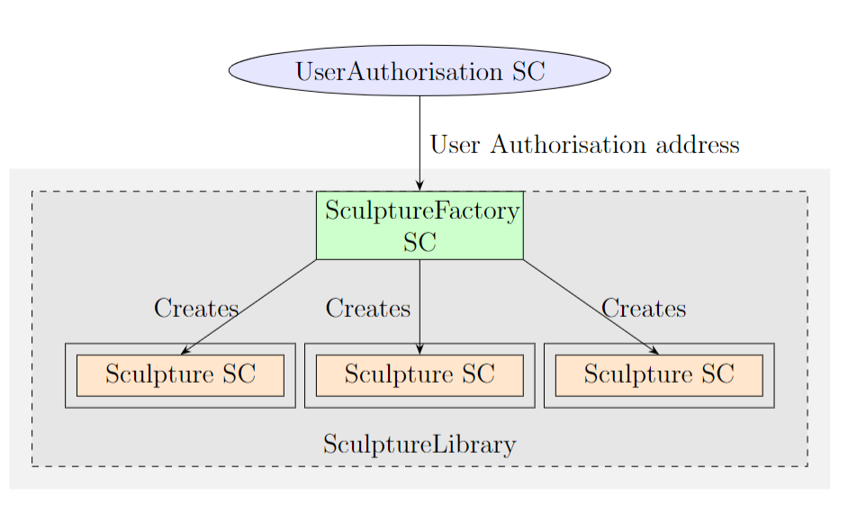
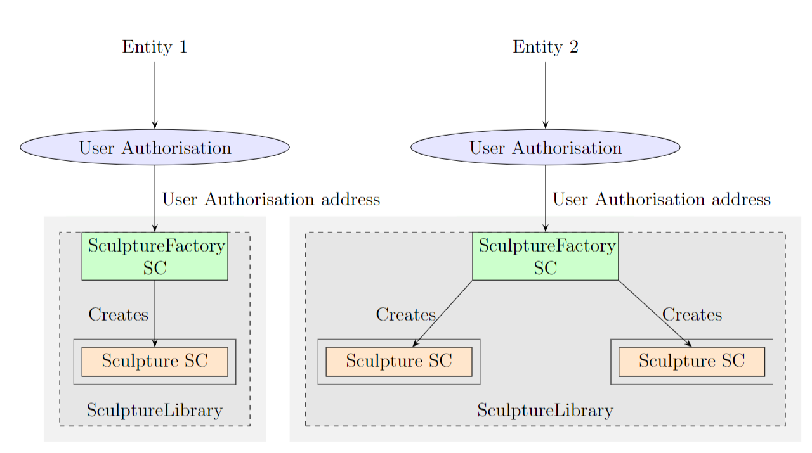

# TFM-Blockchain Sculpture Certification
This thesis delves into the fusion of blockchain technology and the art industry, specifically focusing on the certification of sculptures in museum contexts. The main objective is to take advantage of blockchain capabilities to create a secure and verifiable system for issuing smart contracts that certify sculptures and provide a complete record of their data. Primarily based on the concept of a "Smart Contract Factory" implemented on the blockchain, offering authorized parties the ability to generate Sculpture Smart Contracts. These contracts encapsulate pertinent information about each sculpture, acting as digital certificates that interested parties can easily verify.

Repository created and adapted based on Scaffold as a base repository
- https://github.com/scaffold-eth/scaffold-eth

## Smart Contracts architecture design
The Architecture of this design is:

- *Main architecture design:*


- *Architecture design for different Entities:*


### UserAuthorisation
“UserAuthorisation” is the root Smart Contract in the entire hierarchy. The purpose of this Smart Contract is to enable the management of different privileges for each user and control user access when using both the capabilities provided by “SculptureFactory” and the “Sculpture” Smart Contracts. This control is necessary because, in accordance with the project requirements, certain data related to sculpture records can be modified after
their creation.

The different capabilities of this Smart Contract are:
- Grant permissions: Grant permissions for new users to create or update records within the associated Sculpture Factory governance.
- Change authorization level: Adjust the authorization level for any user, either increasing or decreasing their privileges.
- Remove authorization: Completely revoke authorization for a user to create or update records governed by the associated Sculpture Factory, which means removing its address from the Smart Contract storage.
- Transaction history View a history of transactions carried out in this contract to grant, change, or remove user permissions.

The different permissions or privileges that a user can have are:
- NONE: A user who has been authorized at some point in the past but has had all privileges disabled, either for a specified period or indefinitely, but their address is still stored in the Smart Contract storage.
- USER: Users who can only update an existing Sculpture record.
- ADMIN: Users who can not only create or update Sculpture records but can also carry out any authorization management for new or existing users.

Note that there will always be at least one ADMIN user, so it is not possible to remove all ADMIN users from any user authorization smart contract. However, it is possible to replace an existing ADMIN user with a new one.

### SculptureFactory
SculptureFactory is the Smart Contract responsible for enabling the creation of sculpture records for users authorized with ADMIN privileges. To verify if a user is authorized, this Smart Contract needs to use the capabilities provided by UserAuthorisation. For this reason, SculptureFactory shall be deployed after UserAuthorisation, primarily to store the UserAuthorisation address. This address is used to perform the necessary queries to fulfill its purpose, which is to enable the creation of new Sculpture Records.

Prior to generating new Sculpture records, this Smart Contract meticulously verifies the accuracy of the supplied data. It parses each element in accordance with the guidelines described in the Project scope and requirements. It will revert the transaction by throwing an error along with a message in case of receiving any field that does not follow the requirements established in this project.

Furthermore, it contains a registry to store all the Sculpture instances created by its own governance. This allows any user to access the addresses of all records issued by this Smart Contract, providing a transaction history for the management of all created records.

### Sculpture
Sculpture Smart Contracts are those interpreted as sculpture records, which reference the certification of a sculpture as such. This information is provided by a reputable entity and carried out by the designated key individuals in each entity, those with ADMIN privileges.

The code for this Smart Contract is integrated into the SculptureFactory SC itself. In this way, two different contracts are contained within the same Solidity file. Importantly, the creation of Sculpture instances can only be achieved through the method provided by the SculptureFactory instance. This ensures the adherence to the hierarchy outlined in the architecture and architecture entities images, thus maintaining a controlled architecture for the number of Sculpture records created under a particular governance. Additionally, this requirement is used to oversee the management of authorized users when creating new records.

Following the project requirements, it is necessary for certain fields to be mutable after creating any record. In the world of Art, new discoveries may necessitate updating various data points for an artwork, such as its creation date. Therefore, all instances of sculpture created provide the capability to update project-regulated data, with the caveat that transactions containing data not following the established standards will be reversed, as is done when creating a new record. To accomplish this, this Smart Contract also employs data parsing to verify the correctness of the data before validating the transaction.

Additionally, each instance of this Smart Contract has the ability to retrieve the stored data from the corresponding Sculpture record, allowing any user to access this information.

## SculptureLibrary
The SculptureFactory and Sculpture contracts are created in the same Solidity file, each with its respective constructor, which results in the need for both to use common code. This is where SculptureLibrary comes into play. This library provides shared code to be used by both Smart Contracts.

## Environment requirements
- TFM-Sculptures-in-Blockchain-Scaffold-eth repository
- Node version: v18.10.0
- GNOME Terminal 3.48.1 using VTE 0.72.2 +BIDI +GNUTLS +ICU +SYSTEMD
- npm version 9.2.0
- yarn version 1.22.19
- hardhat

## Environment setup

Clone this repository in your mahcine: 
```
┌──(kali㉿kali)-[~]
└─$ git clone https://github.com/Petterr24/TFM-Sculptures-in-Blockchain-Scaffold-eth
```

Additional packages are needed, in case of having an issue when updating the Linux OS you maybe need to run this command:
```
sudo apt-key adv --refresh-keys --keyserver keyserver.ubuntu.com
````

Apart from that, you should run:
```
┌──(kali㉿kali)-[~]
└─$ sudo apt-get update
```

Annd you could also upgrade your machine:
```
┌──(kali㉿kali)-[~]
└─$ sudo apt-get upgrade
```

Then, you need to install **gnome-terminal** and **express** in the root directory:
```
┌──(kali㉿kali)-[~]
└─$ sudo apt-get install gnome-terminal
```
```
┌──(kali㉿kali)-[~]
└─$ npm install express
```

Once *gnome-terminal* and *express* have been installed, you need to move to the TFM-Sculptures-in-Blockchain-Scaffold-eth directory and there execute the following commands:
```
┌──(kali㉿kali)-[~/TFM-Sculptures-in-Blockchain-Scaffold-eth]
└─$ npm install --global yarn
```
```
┌──(kali㉿kali)-[~/TFM-Sculptures-in-Blockchain-Scaffold-eth]
└─$ yarn install
```
```
┌──(kali㉿kali)-[~/TFM-Sculptures-in-Blockchain-Scaffold-eth]
└─$ yarn global add nx
```
```
┌──(kali㉿kali)-[~/TFM-Sculptures-in-Blockchain-Scaffold-eth]
└─$ npm install --global hardhat
```

## Configuration setup for Goerli TestNet

You need to create different accounts to be able to run this Application on the Goerli TestNet. For each platform, you need to obtain an API key so you shall add their values into the corresponding .env files.
There are two different .env files, one is for hardhat and the other is for react-app:

- **packages/hardhat/.env**: used to deploy the SCs. Fields to be filled are (for instance):

```
GOERLI_INFURA_KEY=bc176..
GOERLI_DEPLOYER_PRIV_KEY=816a..
```

- **packages/react-app/.env**: used to interact the Scaffold UI with the Blockchain system.

```
# RPC keys
REACT_APP_INFURA_KEY=bc176.
REACT_APP_ALCHEMY_KEY=TGI_8..

# Etherscan API key(s)
REACT_APP_ETHERSCAN_API_KEY=TWQ3..

# Blocknative Dapp ID
REACT_APP_BLOCKNATIVE_DAPP_ID=b9ad-7..
```

The following websites are where you need to create an account to obtain the requested API Keys:

- **METAMASK**: https://metamask.io/:
    - It is used to create a wallet. Once a wallet is created, you need to obtain the Private key associated to that Wallet in order to complete the following field.
        - **GOERLI_DEPLOYER_PRIV_KEY**: *Please note that this Private key is used for hardhat environment, it means that this key will be the one used to deploy the Smart Contracts; if you want to deploy new Smart Contracts with another wallet account then you need to change this value by using the new account.*
- **INFURA**: https://app.infura.io/login
    - Infura API keys provide easy access to the Ethereum network, and enable us to supply the data and connections that matter to you. The same Infura API Key shall be added to both .env files:
        - **GOERLI_INFURA_KEY**
        - **REACT_APP_INFURA_KEY**
- **ALCHEMY**: https://www.alchemy.com/
    - Alchemy is the leading blockchain API. It can be used on popular blockchains such as Ethereum to do common operations like consult gas price, get blocks and send transactions.
        - **REACT_APP_ALCHEMY_KEY**
- **ETHERSCAN**: https://etherscan.io/login?cmd=last
    - The Etherscan API keyis used to authenticate and authorize access to the Etherscan API services. Etherscan is a popular block explorer and analytics platform for Ethereum and Ethereum-based blockchains.
        - **REACT_APP_ETHERSCAN_API_KEY**
- **BLOCKNATIVE**: https://explorer.blocknative.com/account
    - The BLOCKNATIVE API key, also known as the BLOCKNATIVE Dapp ID, is used for integrating and accessing services provided by Blocknative, a platform that offers tools and infrastructure for enhancing the user experience of decentralized applications (DApps) and blockchain interactions.
        - **REACT_APP_BLOCKNATIVE_DAPP_ID**

## Starts the User Interface
Run the following command to start the main User Interface
```
┌──(kali㉿kali)-[~/TFM-Sculptures-in-Blockchain-Scaffold-eth]
└─$ node index.js
```